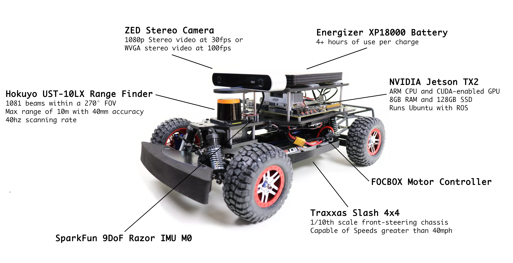

## Model-T ([NVIDIA Jetson TX2](https://developer.nvidia.com/embedded/buy/jetson-tx2-devkit))

[Bill of Materials (Model-T)](
https://docs.google.com/spreadsheets/d/1uBImPVY82Y1d5BRhywwjz3CI9nG4AKZsTNbz1H29JDM/edit?usp=sharing)

 
## Model-X ([NVIDIA AGX Xavier](https://www.developer.nvidia.com/embedded/buy/jetson-agx-xavier-devkit))
_Check out the live prototype model. Public release coming soon!_

 
## Model-N ([NVIDIA Jetson Nano](https://developer.nvidia.com/embedded/buy/jetson-nano-devkit))
_Check out the live prototype model. Public release coming soon!_

 
[Back](./)
